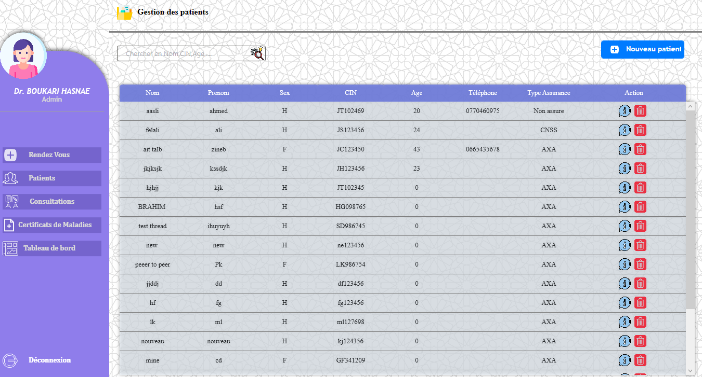
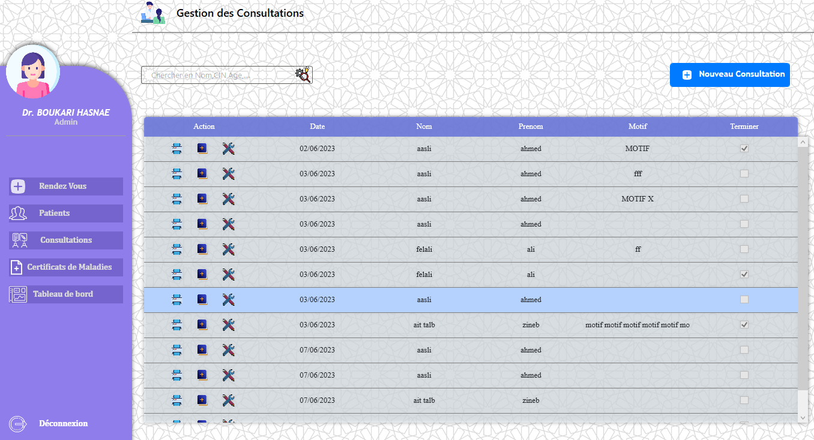
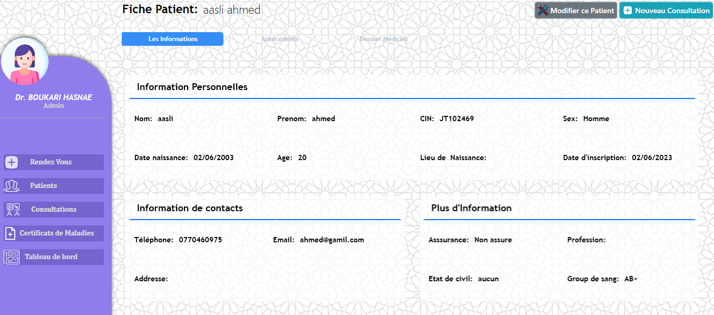
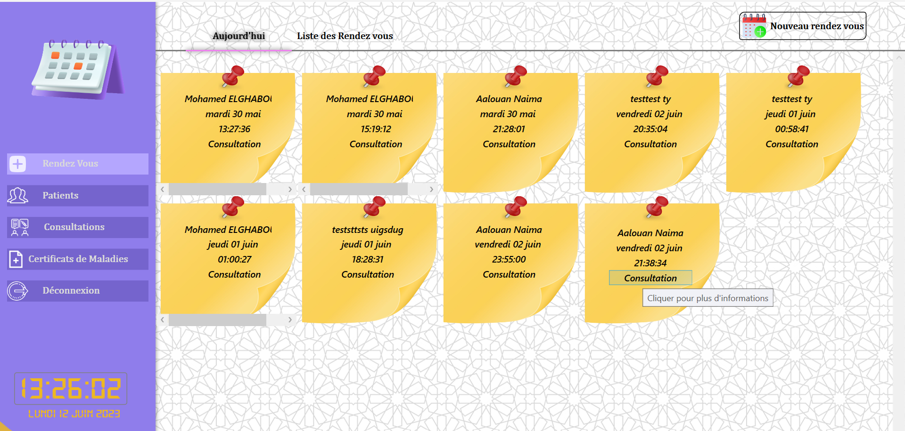

# Clinique Projet

This project is a clinic management application designed to streamline various operations within a clinic. It includes features for managing consultations, patient records, appointments, and more.

## Project Structure

- **connectionDb/**: Contains database connection logic.
- **Controlers/**: Includes various UI controls and their associated logic for managing different aspects of the clinic.
- **DatabaseModels/**: Contains models representing the database structure.
- **forms/**: Likely contains form templates for user input.
- **images/**: Stores image assets used in the application.
- **Modal/**: Contains modal dialog components.
- **validation/**: Includes validation logic for user inputs and data.

## Key Features

- Patient management
- Appointment scheduling
- Consultation tracking
- Medical record management
- Parameter configuration for medical data

## How to Run

1. Open the `Clinique_Projet.sln` file in Visual Studio.
2. Build the solution to restore dependencies and compile the project.
3. Run the application using the Visual Studio debugger.

## Dependencies

- .NET Framework (specific version required by the project)
- Visual Studio (for development and debugging)

## Assets

The project includes various image assets and icons used in the UI, located in the `Controlers/` and `images/` directories.

## 🛠️ Technologies & Languages

  
  
  
  

## 🔧 Tools

  
  
  
  

## Screenshots

### Patient Management

### Login

### Consultation Management

### Patient Record

### Appointment List

